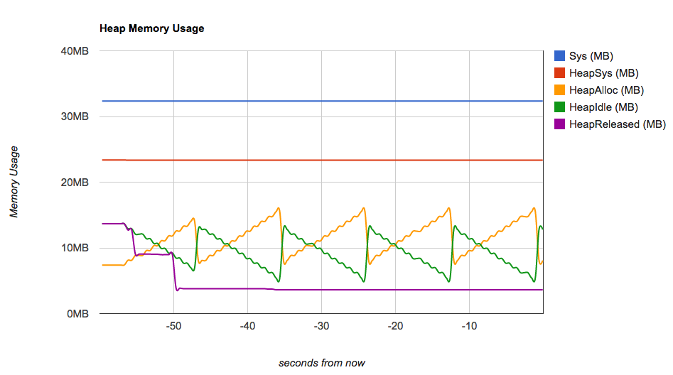

Web-Based Memory Profiler for Go Services [](https://travis-ci.org/wblakecaldwell/profiler) [](https://godoc.org/github.com/wblakecaldwell/profiler)
=========================================

Profiler helps you track your service's memory usage and custom key/value diagnostic info.




Enabling Memory Profiling
-------------------------

The simplest way to use the profiler is to add its endpoints to your HTTP listener. 
See the [extra_service_info](examples/extra_service_info/) example for how to
serve the profiler's endpoints on its own IP/port.

```go
import (
	"net/http"
	"github.com/wblakecaldwell/profiler"
)
func main() {
	// add the profiler handler endpoints
	profiler.AddMemoryProfilingHandlers()

    // add realtime extra key/value diagnostic info (optional)
	profiler.RegisterExtraServiceInfoRetriever(extraServiceInfo)

	// start the profiler on service start (optional) 
	profiler.StartProfiling()

	// listen on port 6060 (pick a port)
	http.ListenAndServe(":6060", nil)
}

// extraServiceInfo returns key/value diagnostic info
func extraServiceInfo() map[string]interface{} {
    extraInfo := make(map[string]interface{})
    extraInfo["uptime"] = fetchUptime()
	extraInfo["successful connection count"] = fetchSuccessfulConnectionCount()
	extraInfo["failure connection count"] = fetchFailureConnectionCount()
    return extraInfo
}
``` 

Using Memory Profiling
----------------------

Enabling Memory Profiling exposes the following endpoints:

- http://localhost:6060/profiler/stop :    Stop recording memory statistics
- http://localhost:6060/profiler/start :   Start recording memory statistics
- http://localhost:6060/profiler/info.html :   Main page you should visit
- http://localhost:6060/profiler/info :   JSON data that feeds profiler/info.html


Examples
--------

View and/or run the three working examples in the [examples](examples/) folder:

1. [Simple](examples/simple/): Serving the profiler's endpoints to a service's single HTTP IP:port
2. [Separate Port](examples/separate_port/): Serving the profiler's endpoints on its own IP:port
3. [Extra Service Info](examples/extra_service_info/): Same as the previous example, with the profiler also reporting diagnostic key/value pairs


Working With the Template Files
-------------------------------

Template files are bundled in the Go binary with the 'go-bindata' tool. Everything in
github.com/wblakecaldwell/profiler/profiler-web is bundled up into github.com/wblakecaldwell/profiler/profiler-web.go
with the command, assuming your repository is in $GOPATH/src.

Production Code Generation (Check this in):

```shell
go get github.com/jteeuwen/go-bindata/...
go install github.com/jteeuwen/go-bindata/go-bindata

go-bindata -prefix "$GOPATH/src/github.com/wblakecaldwell/profiler/profiler-web/" -pkg "profiler" -nocompress -o "$GOPATH/src/github.com/wblakecaldwell/profiler/profiler-web.go" "$GOPATH/src/github.com/wblakecaldwell/profiler/profiler-web"
```

If you'd like to make changes to the templates, then use 'go-bindata' in debug mode. Instead of compiling
the contents of the template files into profiler-web.go, it generates code to read the content of the template
files as they exist at that moment. This way, you can start your service, view the page, make changes, then
refresh the browser to see them:

Development Code Generation:

```shell
go-bindata -debug -prefix "$GOPATH/src/github.com/wblakecaldwell/profiler/profiler-web/" -pkg "profiler" -nocompress -o "$GOPATH/src/github.com/wblakecaldwell/profiler/profiler-web.go" "$GOPATH/src/github.com/wblakecaldwell/profiler/profiler-web"
```

When you've wrapped up development, make sure to rebuild profiler-web.go to contain the contents of the file with the first non-debug command.
