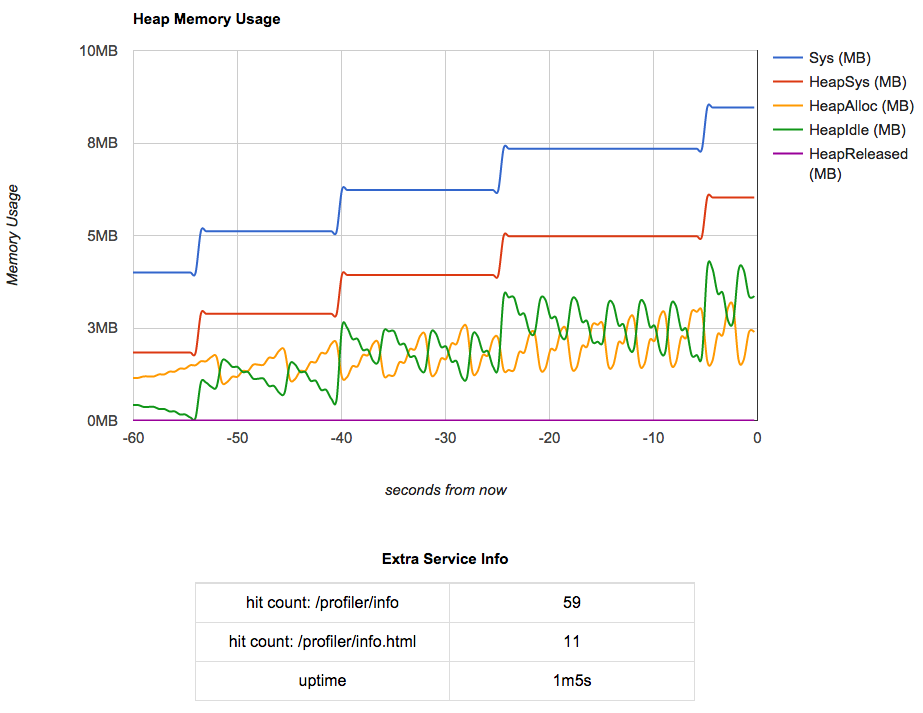

Example: Sharing Extra Service Information
==========================================

The profiler not only shows you the heap memory usage, but it also gives
your service the opportunity to share some extra diagnostic information as
key/value pairs. You supply the profiler with a function that returns a `map`,
and the profiler will call it when someone is viewing its web page.

```go
// extraServiceInfo implements the profiler.ExtraServiceInfoRetriever interface,
// returning a map of key/value pairs of diagnostic information.
func extraServiceInfo() map[string]interface{} {
	extraInfo := make(map[string]interface{})
	extraInfo["hello"] = "world"
	extraInfo["good number"] = 42
	return extraInfo
}

func main() {
   // set up the profiler
   // ... 

   // give the profiler a function that returns key/value pairs of extra service info
   profiler.RegisterExtraServiceInfoRetriever(extraServiceInfo)
}
```


Run the Example
---------------

Fetch, build, and run the example service:

```shell
go get github.com/wblakecaldwell/profiler
go build github.com/wblakecaldwell/profiler/examples/extra_service_info
./extra_service_info
```

Verify the 'Hello, World!' endpoint at http://localhost:8080

Verify the profiler is running on its own port at http://localhost:6060/profiler/info.html



