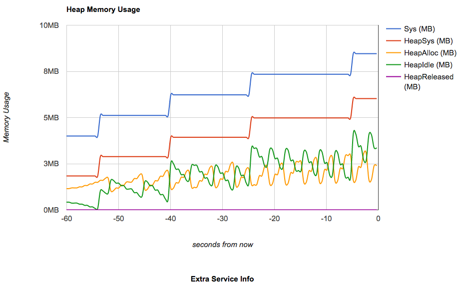

Example: Simple
===============

Here's a simple example, using the least amount of effort possible. The profiler is using
the same IP:port as the web service. The only addition we need is:

```go
// add handlers to help us track memory usage - they don't track memory until they're told to
profiler.AddMemoryProfilingHandlers()
```

Run the Example
---------------

Fetch, build, and run the example service:

```shell
go get github.com/wblakecaldwell/profiler
go build github.com/wblakecaldwell/profiler/examples/simple
./simple
```

Verify the "Hello, World!" endpoint at http://localhost:8080

Verify the profiler is running at http://localhost:8080/profiler/info.html


